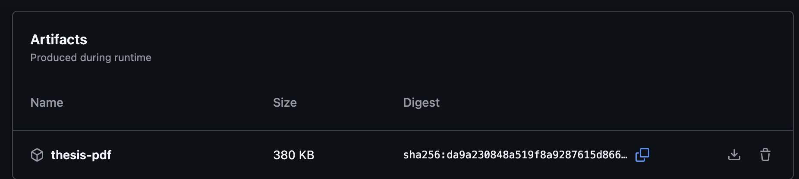

# Templat LaTeX Tesis Informatika ITB

[](https://github.com/petrabarus/if-itb-latex/actions/workflows/build.yml)

**oleh:** Petra Novandi · [me@petrabarus.net](mailto:me@petrabarus.net)

Dokumen ini merupakan templat LaTeX yang ditujukan untuk laporan tesis di program studi Teknik Informatika ITB. Templat ini penulis gunakan dalam penulisan laporan tesis penulis dan dengan semangat berbagi penulis memutuskan untuk mempublikasikan templat ini agar dapat digunakan oleh banyak orang.

Silakan mengunduh, menggunakan, memodifikasi, dan menyebarkan templat ini. :)

## Memulai

Cara termudah untuk menggunakan templat ini:

1. **Fork** repositori ini di GitHub ke akun Anda.
2. **Clone** fork Anda ke komputer lokal.
3. **Tulis** tesis Anda — mulai dari `src/thesis.tex` (judul dan penulis), lalu isi berkas di `src/chapters/`.
4. **Bangun** PDF dengan `make` (lihat [Penggunaan](#penggunaan)), atau **push** ke branch `main`/`master` di fork Anda untuk membangun PDF otomatis di GitHub Actions (lihat [CI / Build Otomatis](#ci--build-otomatis)).

Anda tidak perlu mengunduh arsip ZIP atau membuat proyek LaTeX dari nol. Cukup fork, clone, tulis, dan kompilasi — lokal atau lewat GitHub Actions.

## Kebutuhan

Templat ini membutuhkan TeX Live (Linux/macOS) atau MiKTeX/TeX Live (Windows) beserta paket berikut:

- `texlive-latex-recommended`, `texlive-latex-extra`, `texlive-fonts-recommended`
- `texlive-bibtex-extra`, `biber`, `xzdec`, `texlive-lang-other`
- `latexmk`

Pada Ubuntu/Debian, instalasi dapat dilakukan dengan perintah berikut:

```bash
sudo apt-get -qq update && sudo apt-get install -y --no-install-recommends \
    texlive-latex-recommended texlive-latex-extra texlive-fonts-recommended \
    texlive-bibtex-extra biber xzdec texlive-lang-other latexmk
```

## Penggunaan

Templat ini dilengkapi skrip kompilasi. Untuk membangun dokumen:

**Linux/macOS:**

```bash
make          # bersihkan lalu bangun
make build    # bangun saja (tanpa clean)
make validate # periksa sumber LaTeX dengan chktex
make clean    # hapus artefak build
```

**Windows:**

```bat
make.bat
```

Hasil kompilasi berada di `dist/thesis.pdf`. File sementara latexmk disimpan di direktori `build/` (keduanya diabaikan oleh git).

## Struktur Proyek

```text
src/
├── thesis.tex              # Berkas utama; atur judul, penulis, dan daftar bab
├── references.bib          # Database referensi bibliografi
├── config/
│   ├── if-itb-thesis.sty   # Pengaturan format dokumen
│   ├── informations.tex    # Informasi umum tesis
│   └── hypenation-id.tex   # Aturan pemenggalan kata Bahasa Indonesia
├── resources/
│   ├── cover-ganesha.jpg
│   ├── chapter-2-infrastructure-diagram.png
│   ├── chapter-3-sample-requirements.csv
│   └── chapter-3-sample-components.csv
└── chapters/
    ├── cover.tex           # Halaman sampul
    ├── approval.tex        # Lembar persetujuan
    ├── statement.tex       # Lembar pernyataan
    ├── abstract-id.tex     # Abstrak Bahasa Indonesia
    ├── abstract-en.tex     # Abstract (English)
    ├── forewords.tex       # Kata pengantar
    ├── chapter-1.tex … chapter-5.tex
    └── appendix-1.tex, appendix-2.tex
```

## Menulis Tesis

- Setiap berkas `.tex` memiliki komentar header di bagian atas yang menjelaskan fungsi berkas tersebut.
- Atur `\title` dan `\author` di `src/thesis.tex`.
- Tulis isi bab di `src/chapters/chapter-N.tex`. Untuk menambah bab baru, buat berkas baru lalu tambahkan `\input{chapters/chapter-N}` di `thesis.tex`.
- Bab I–V dilengkapi teks panduan sebelum placeholder; ganti dengan isi sebenarnya saat menulis.
- Teks placeholder (`\blindtext`) tersedia di bab, subbab, dan subsubbab — contoh struktur subbab ada di Bab III dan IV.
- Tambahkan referensi di `src/references.bib` dan sitasi dengan `\parencite{key}`.

### Tabel dari CSV

Templat mendukung tabel yang diisi dari berkas CSV menggunakan paket `csvsimple` (termasuk dalam `texlive-latex-extra`). Contoh ada di Bab III (`Rancangan Solusi`):

```latex
\begin{table}[ht]
    \centering
    \caption{Kebutuhan fungsional sistem}
    \label{tab:sample-requirements}
    \csvautotabular{resources/chapter-3-sample-requirements.csv}
\end{table}
```

Tabel dengan `\caption` otomatis masuk ke **Daftar Tabel**. Simpan berkas CSV di `src/resources/` dan sesuaikan path relatif dari direktori `src/`.

## CI / Build Otomatis

GitHub Actions menjalankan job **Validate LaTeX** (`make validate` dengan chktex dan pemeriksaan berkas resource) pada pull request ke `main`/`master`. Job **Build PDF** hanya dijalankan pada push ke `main`/`master`.

Jika Anda tidak ingin membangun PDF secara lokal, cukup **push** perubahan ke branch `main` atau `master` di fork repositori Anda. GitHub Actions akan mengompilasi tesis dan mengunggah hasilnya sebagai artifact **`thesis-pdf`**. Unduh PDF terbaru dari tab **Actions** → pilih workflow run → bagian **Artifacts**:



## Changelog

Lihat [CHANGELOG.md](CHANGELOG.md) untuk riwayat perubahan.

## Kontribusi

Templat ini dapat digunakan secara gratis, akan tetapi penulis sangat berharap adanya kritik serta saran dari pengguna untuk meningkatkan kualitas hasil dan penggunaan templat ini.

Kritik dan saran dapat dikirim melalui [GitHub Issues](https://github.com/petrabarus/if-itb-latex/issues).

## Terima Kasih

- [Steven Lolong](https://github.com/steven-lolong) atas pemberian templat LaTeX yang asli.
- [Peb Ruswono Aryan](https://github.com/pebbie) atas bantuan pelengkapan struktur dokumen.
